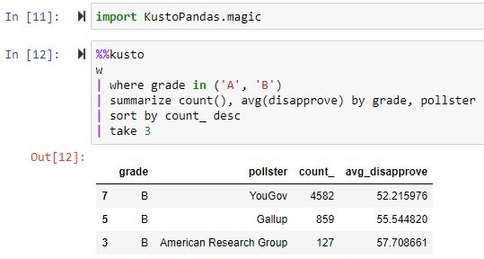

KustoPandas is a wrapper around a Pandas DataFrame which allows you to use the syntax of the 
[Kusto Query Language](https://docs.microsoft.com/en-us/azure/data-explorer/kusto/query/) to transform the data frame.  Under the hood the commands are converted to the corresponding Pandas method, so you get all the performance of Pandas, but with the nice syntax of Kusto.

See the following jupyter notebooks for example usage

[KustoPandas walkthrough](https://github.com/js850/KustoPandas/blob/master/examples/kusto_pandas_walkthrough.ipynb)

[Trump approval ratings](https://github.com/js850/KustoPandas/blob/master/examples/trump_approval_ratings.ipynb)


Here are some very basic usage examples.  Please see the walkthrough above for more details.

```python
import pandas as pd
from kusto_pandas import Wrap
dataframe = pd.read_csv("data.csv")
w = Wrap(dataframe)

w.where("Column1 > 0").summarize("count(), AvgOfCol1 = avg(Column1) by Column2")

```

In the above, multiple tabular operators are chained together, however if you prefer you can enter the full Kusto query 

```python
w.execute("""
w
| where Column1 > 0
| summarize count(), AvgOfCol1 = avg(Column1) by Column2
""")
```

If you are working in a Jupyter notebook, then you may find it more convenient to use an IPython magic



Dependencies
------------
KustoPandas depends on Pandas (obviously) but it also depends on the package [parsimonious](https://github.com/erikrose/parsimonious) to do the parsing of the Kusto language. You can install parsimonious using pip

`pip install parsimonious`

Installation
------------
KustoPandas is not yet pip installable.  If you want to use KustoPandas, then download the package to some location on your computer and add that location to your PYTHONPATH.


(This package is still a work in progress.  Some kusto commands are not yet mapped to the corresponding Pandas command.  I will add more and more functionality as time goes on.  Please feel free to contribute.)
